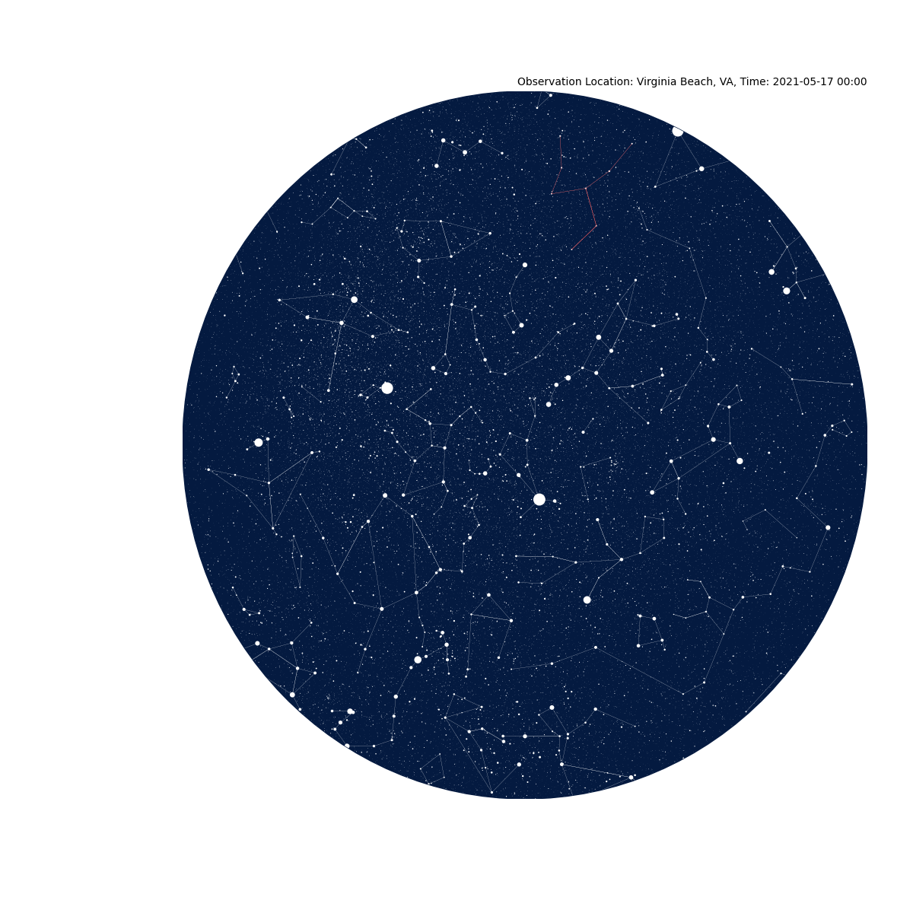

# Star-map Generating Streamlit App #

> Streamlit deployment can be seen [here.](https://takotime808-starmap-dreamcatchers-streamlit-app-5e9vwi.streamlit.app/)

Generate a star map based on a user designated location, date, and given.

The [hosted streamlit page](https://takotime808-starmap-dreamcatchers-streamlit-app-5e9vwi.streamlit.app/) takes 
in date, military formatted time, and location, then returns the corresponding star chart.

### To Do ###
:soon: Convert star charts into STL dreamcatchers that users can 3d print

#### Examples ####

